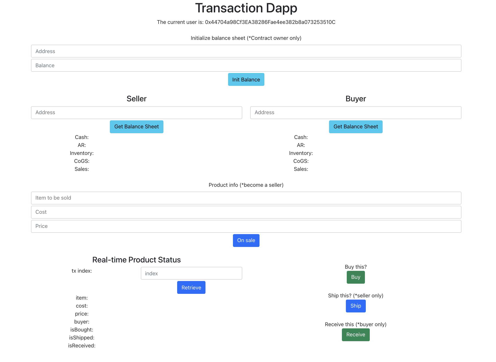

# A Transaction Dapp
## Description
"Transaction Dapp" is a very useful dapp for online shopping and also a basis for advanced trading scenarios, comprising web frontend with Metamask and blockchain backend deployed on (Ropsten) testnet. 

Any user can easily create a sales order by using Metamask and become a seller. Other users can check the real-time product status on the blockchain and then decide to buy it or not. After that, the seller and the buyer take turns to finish the shipment and reception of the product(we consider that the delivery of goods or finish of services are necessary to complete a real-world transaction, also from the perspectives of conventional accounting and auditing).

Furthermore, as the transaction process (and accounting process) moves on, the Transaction Dapp also provides balance sheets.

### Address of contract
0x6466aa98d9A2055570dC3ba71D232dc30A08BfA6

### URL on Etherscan to check
https://ropsten.etherscan.io/address/0x6466aa98d9A2055570dC3ba71D232dc30A08BfA6

## Frontend UI
https://rayhungkao.github.io/transaction-dapp/

### ghpage illustrated below


---

## System design
Put backend first, local test mainly rely on Truffle, and final deployment rely on Infura. On the other hand, frontend, web development and local test with react, and then deployment on Github pages.

* Note: frontend scripts are detailed in /client/README.md

## Requirements
1. Use your Metamask account and a supported web browser e.g. Chrome.
2. Install Node.js and npm
#### Version of Node.js I use
```
    $node --version
    v16.13.0
```
#### Version of npm I use
```
    $npm --version
    8.1.0
```

## Environment setup
truffle and react
```
    $npm install -g truffle
    $truffle unbox react
    $npm install @truffle/hdwallet-provider
```

## Test for contract by truffle
```
    $truffle develop
    $compile    //inside truffle console
    $migrate    
    $test       //by default it runs all test files
```
or run specific test file
```
    $truffle test ./test/transaction.js
```

## Deploy the contract to Ropsten by truffle and infura
```
    $truffle migrate --network ropsten
```